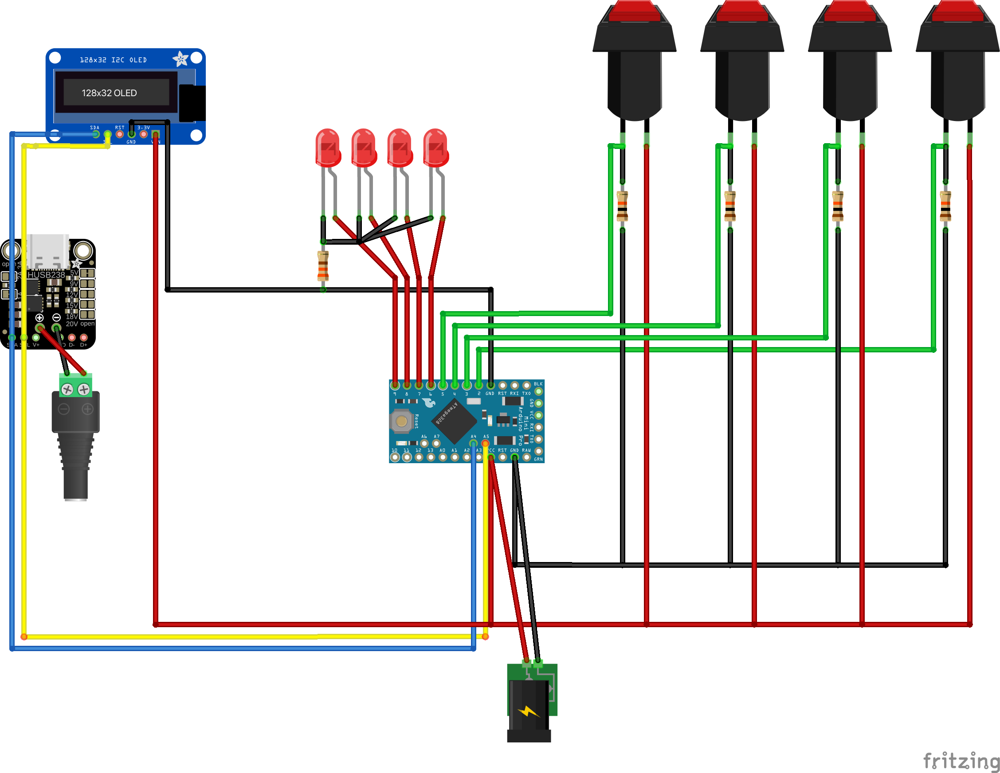

## Purpose
While I'm well aware USB-PD->DC cables exist, these are preset to a specific voltage. Using the same USB-PD with different devices needing different voltages means unplugging and plugging in a different cable each time. There has to be a better solution, and thanks to Adafruit, we can make it!
This design uses 4 LED lit push button switches, and a 0.91 inch OLED screen, to choose from 5v (default), 9v, 12v, and 20v. When first turned on, 5v is chosen by default.

## Usage
The unit requires the following power inputs:
[cols=2*,options=]
|===
|5v to Arduino
| Ensure the Arduino receieves a consistent power output and preserve all available current through USB-PD is available for any devices you have connected.
| USB-PD
| The main power input. Please ensure your USB-PD power supply supports all of the voltages you plan to use.
|===
Pressing a specific voltage pushbutton results in that switch lighting up and the OLED screen displaying the currently operating voltage. If the selected voltage cannot be set, either due to a communications error or the USB-PD power source not supporting that voltage, an error will be displayed and the previously working voltage left enabled.

## Status
This is a work in progress, expect updates to be posted as time/testing permits

### Done
[.list]
* Component List
* Pin count confirmation
* Arduino microcontroller restrictions confirmed
* Parts ordering
* Pinout and wiring confirmation
* Switch/LED/OLED screen code validation in simulation
* 3D case designed and parts test-fitted

### To Do
[.list]
* Connect Arduino, Switches, LEDs, and OLED to confirm code functionality with hardware
* Connect HUSB238 and confirm initialization/response
** Confirm continued functionality with OLED
* Connect USB-PD source
** Confirm each voltage change occurs
** Measure output with voltmeter
* Finalize and publish

## Components
[cols="^,<,<,^",options=header]
|===
| Quantity
| Name
| Purpose
| Link
| 1
| Adafruit USB Type C Power Delivery (HUSB238)
| Does USB-PD heavy lifting and supports I2C control for "on the fly" voltage changes.
| https://www.adafruit.com/product/5807
| 1
| Adafruit Monochrome 0.91 inch Display (OLED)
| Provides a feedback mechanism to the user to confirm if the chosen voltage was changed successfully or if the USB-PD power source does not support that voltage.
| https://www.adafruit.com/product/4440
| 4
| Adafruit 16mm Illuminated Push Button Momentary
| Used to choose which voltage you want.
| https://www.adafruit.com/product/1440
| 1
| ATmega328P based Arduino
| The control brains. Contains the code to control the USB-PD board and OLED screen.
| Favorite component source
| 4
| 10k Ohm Resistors
| Pulldown resistor for each switch.
| Favorite component source
| 1
| 330 Ohm Resistor
| Current limiting resistor for LEDs for indicating currently enabled voltage.
| Favorite component source
| 1
| DIY OEM Type C Female Socket
| Dedicated 5v power for control Arduino
| https://www.amazon.com/dp/B0D5B82V6K
|===

## Wiring Diagram
For those who want a more checklist type wiring list, here is the table of Arduino Pins to component pins/pads, if there is an inline resistor, and a handy extra space to mark off when you've completed that connection.
[cols="^,^,^,^",options="header"]
|===
| Ardunio Uno Pin
| Inline Resistor Value
| Component Pin/Pad
| Done?
| Ground
| 330 Ohm
| Cathode (negative) of each LED. All LEDs can be tied together and linked to one resistor
|
| Ground
| 10K Ohm
| Pin 1 of "5v" Switch
|
| Ground
| 10K Ohm
| Pin 1 of "9v" Switch
|
| Ground
| 10K Ohm
| Pin 1 of "12v" Switch
|
| Ground
| 10K Ohm
| Pin 1 of "20v" Switch
|
| 5v (Vcc on some Arduino models)
| 
| Pin 2 of each Switch, VIN on OLED, V+ on HUSB238
|
| 2
| 
| Pin 1 of "5v" Switch
|
| 3
| 
| Pin 1 of "9v" Switch
|
| 4
| 
| Pin 1 of "12v" Switch
|
| 5
| 
| Pin 1 of "20v" Switch
|
| 9
| 
| Anode (positive) of "20v" indicator LED
|
| 10
| 
| Anode (positive) of "12v" indicator LED
|
| 11
| 
| Anode (positive) of "9v" indicator LED
|
| 12
| 
| Anode (positive) of "5v" indicator LED
|
| A4
| 
| SDA pins on OLED and HUSB238
|
| A5
| 
| SCL pins on OLED and HUSB238
| 
|===

For those who are more visually oriented, here is a Fritzing wiring diagram:

